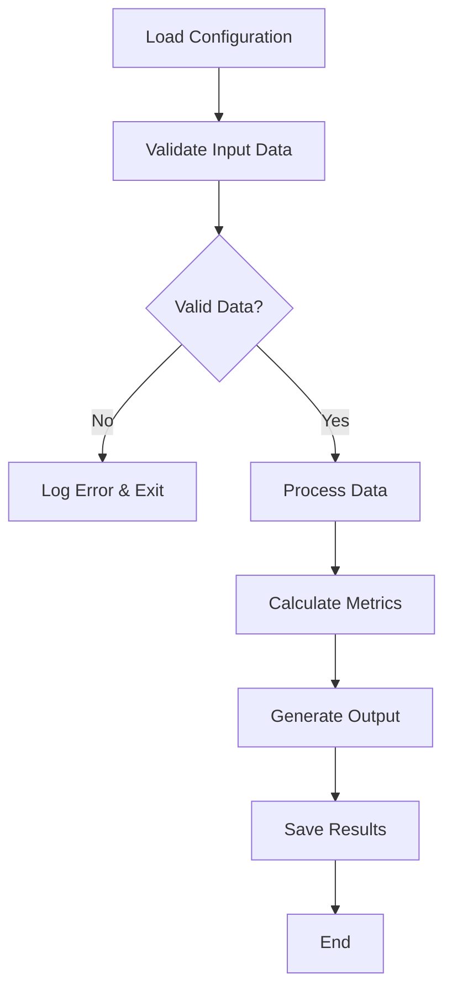

# Python Project Copilot Instructions

## Code Style and Standards

### Python Best Practices
- Follow **PEP 8** style guidelines for code formatting
- Use **snake_case** for function names, variables, and module names
- Use **PascalCase** for class names
- Use **UPPER_SNAKE_CASE** for constants
- Implement **proper error handling** with try/except blocks
- Use **docstrings** for all modules, classes, and functions
- Follow **SOLID principles** for object-oriented design

### Naming Conventions
- Functions: `get_user_data()`, `process_file()`
- Variables: `user_account`, `file_path`
- Classes: `DataProcessor`, `ConfigurationManager`
- Constants: `DEFAULT_TIMEOUT = 30`, `MAX_RETRIES = 3`
- Private methods: `_internal_method()`

### Function Design
```python
from typing import Optional, List, Dict, Any
from pathlib import Path

def process_data_file(
    file_path: Path,
    output_format: str = "json",
    timeout_seconds: int = 30,
    validate_input: bool = True
) -> Optional[Dict[str, Any]]:
    """Process a data file and return results in specified format.
    
    Args:
        file_path: Path to the input data file
        output_format: Format for output ('json', 'csv', 'xml')
        timeout_seconds: Maximum processing time in seconds
        validate_input: Whether to validate input data structure
        
    Returns:
        Processed data dictionary or None if processing fails
        
    Raises:
        FileNotFoundError: If input file doesn't exist
        ValidationError: If input data is invalid
        ProcessingError: If processing fails
    """
```

## Error Handling

### Custom Exception Hierarchy
- Create custom exception classes that inherit from built-in exceptions
- Use specific exception types for different error conditions
- Always provide meaningful error messages with context
- Log errors appropriately before raising or handling

### Example Error Handling Pattern
```python
import logging
from pathlib import Path
from typing import Dict, Any

logger = logging.getLogger(__name__)

class DataProcessingError(Exception):
    """Raised when data processing fails."""
    pass

class ValidationError(DataProcessingError):
    """Raised when data validation fails."""
    pass

def read_config_file(config_path: Path) -> Dict[str, Any]:
    """Read and parse configuration file."""
    try:
        if not config_path.exists():
            raise FileNotFoundError(f"Configuration file not found: {config_path}")
        
        with open(config_path, 'r', encoding='utf-8') as file:
            config = json.load(file)
            
        logger.info(f"Successfully loaded configuration from {config_path}")
        return config
        
    except json.JSONDecodeError as e:
        logger.error(f"Invalid JSON in config file {config_path}: {e}")
        raise ValidationError(f"Configuration file contains invalid JSON: {e}")
    except Exception as e:
        logger.error(f"Unexpected error reading config file: {e}")
        raise DataProcessingError(f"Failed to read configuration: {e}")
```

## Documentation Requirements

### Module Documentation
- Every module must have a module-level docstring
- Include purpose, usage examples, and any important notes
- Document public API and main classes/functions

### Function/Class Documentation
- Use Sphinx-style docstrings consistently
- Document all parameters, return values, and exceptions
- Include usage examples for complex functions
- Add type hints for all parameters and return values

### Example Documentation Template
```python
"""Module for processing financial data and calculating metrics.

This module provides functionality for:
- Loading portfolio data from CSV files
- Calculating dividend yields and statistics
- Generating reports and visualizations

Example:
    from financial_processor import DataProcessor
    
    processor = DataProcessor("data/portfolio.csv")
    results = processor.calculate_yields()
"""

from typing import Optional, List, Dict, Union
from pathlib import Path

class DataProcessor:
    """Processes financial data and calculates various metrics.
    
    This class handles loading, validation, and processing of portfolio data.
    
    Attributes:
        data_file: Path to the input data file
        config: Configuration dictionary for processing options
        
    Example:
        processor = DataProcessor("portfolio.csv")
        yields = processor.calculate_dividend_yields()
    """
    
    def __init__(self, data_file: Union[str, Path], config: Optional[Dict] = None):
        """Initialize the data processor.
        
        Args:
            data_file: Path to the portfolio data file
            config: Optional configuration dictionary
            
        Raises:
            FileNotFoundError: If data file doesn't exist
            ValidationError: If data file format is invalid
        """
    
    def calculate_dividend_yields(
        self, 
        frequency: str = "quarterly"
    ) -> Dict[str, float]:
        """Calculate dividend yields for all holdings.
        
        Args:
            frequency: Dividend frequency ('monthly', 'quarterly', 'annual')
            
        Returns:
            Dictionary mapping ticker symbols to yield percentages
            
        Raises:
            ValidationError: If frequency is not supported
            DataProcessingError: If calculation fails
            
        Example:
            yields = processor.calculate_dividend_yields("quarterly")
            print(f"AAPL yield: {yields['AAPL']:.2f}%")
        """
```

## Testing and Validation

### Testing Framework
- Use **pytest** for unit testing and integration testing
- Implement **test fixtures** for common test data and setup
- Use **parametrized tests** for testing multiple scenarios
- Mock external dependencies and APIs
- Aim for **high test coverage** (>90% for critical code)

### Testing Patterns
```python
import pytest
from unittest.mock import Mock, patch
from pathlib import Path
from your_module import DataProcessor, ValidationError

class TestDataProcessor:
    """Test suite for DataProcessor class."""
    
    @pytest.fixture
    def sample_data_file(self, tmp_path):
        """Create a temporary CSV file with sample data."""
        data_file = tmp_path / "test_data.csv"
        data_file.write_text("ticker,price,shares\nAAPL,150.00,100\n")
        return data_file
    
    @pytest.fixture
    def processor(self, sample_data_file):
        """Create a DataProcessor instance for testing."""
        return DataProcessor(sample_data_file)
    
    def test_successful_initialization(self, processor):
        """Test successful processor initialization."""
        assert processor is not None
        assert processor.data_file.exists()
    
    def test_file_not_found_error(self):
        """Test that FileNotFoundError is raised for missing files."""
        with pytest.raises(FileNotFoundError):
            DataProcessor("nonexistent.csv")
    
    @pytest.mark.parametrize("frequency,expected_multiplier", [
        ("monthly", 12),
        ("quarterly", 4),
        ("annual", 1)
    ])
    def test_frequency_multipliers(self, processor, frequency, expected_multiplier):
        """Test different frequency multipliers."""
        result = processor._get_frequency_multiplier(frequency)
        assert result == expected_multiplier
    
    @patch('your_module.api_client.fetch_data')
    def test_api_integration(self, mock_fetch, processor):
        """Test API integration with mocked responses."""
        mock_fetch.return_value = {"price": 150.00}
        result = processor.fetch_current_prices()
        assert "AAPL" in result
        mock_fetch.assert_called_once()
```

## Performance Considerations

### Efficient Python
- Use **list comprehensions** and **generator expressions** for data processing
- Prefer **polars** for large dataset operations
- Use **asyncio** for I/O-bound operations
- Implement **caching** for expensive computations
- Use **type hints** to enable optimization tools

### Memory Management
```python
from typing import Iterator, List
import pandas as pd

# Good: Memory-efficient generator
def process_large_dataset(file_path: Path) -> Iterator[Dict[str, Any]]:
    """Process large dataset line by line to conserve memory."""
    with open(file_path, 'r') as file:
        for line in file:
            yield process_line(line)

# Good: Efficient pandas operations
def calculate_metrics_efficiently(df: pd.DataFrame) -> pd.DataFrame:
    """Calculate metrics using vectorized pandas operations."""
    return df.assign(
        yield_pct=lambda x: (x['annual_dividend'] / x['cost_basis']) * 100,
        total_value=lambda x: x['shares'] * x['current_price']
    )

# Avoid: Loading entire dataset into memory unnecessarily
def inefficient_processing(file_path: Path) -> List[Dict]:
    with open(file_path, 'r') as file:
        all_data = file.readlines()  # Loads everything into memory
    return [process_line(line) for line in all_data]
```

## Security Best Practices

### Secure Coding
- Never hard-code credentials, API keys, or sensitive information
- Use **environment variables** or secure key management for secrets
- Validate and sanitize all user input
- Use **pathlib.Path** for safe file path handling
- Implement **input validation** for all external data

### Credential and Secret Management
```python
import os
from typing import Optional
from dataclasses import dataclass

@dataclass
class APIConfig:
    """Configuration for API access."""
    api_key: str
    base_url: str
    timeout: int = 30

def load_api_config() -> APIConfig:
    """Load API configuration from environment variables."""
    api_key = os.getenv("ALPHA_VANTAGE_API_KEY")
    if not api_key:
        raise ValueError("ALPHA_VANTAGE_API_KEY environment variable not set")
    
    return APIConfig(
        api_key=api_key,
        base_url=os.getenv("API_BASE_URL", "https://www.alphavantage.co"),
        timeout=int(os.getenv("API_TIMEOUT", "30"))
    )

# Good: Use environment variables
config = load_api_config()

# Avoid: Hard-coded secrets
# api_key = "your_secret_key_here"  # Never do this!
```

## Package Structure

### Project Organization
- Use **src layout** for better package structure
- Include **requirements.txt** and **pyproject.toml** for dependencies
- Organize code into logical modules and packages
- Include **__init__.py** files to create proper packages
- Separate configuration, tests, and documentation

### Directory Structure Guidelines
- **`core/`** - Essential business logic modules that are imported and used by `main.py` on every execution
- **`utils/`** - Standalone scripts that can be run individually for specific tasks (chart generation, portfolio updates, etc.)
- **`api/`** - External API clients and communication modules
- **`config/`** - Configuration management and settings
- **`logging/`** - Logging utilities and configuration

### Recommended File Structure
```
project_name/
├── main.py
├── src/
│   ├── __init__.py
│   ├── core/
│   │   ├── __init__.py
│   │   ├── data_processor.py
│   │   └── yield_calculator.py
│   ├── utils/
│   │   ├── __init__.py
│   │   ├── chart_generator.py
│   │   ├── portfolio_updater.py
│   │   └── csv_processor.py
│   ├── api/
│   │   ├── __init__.py
│   │   └── alpha_vantage_client.py
│   ├── config/
│   │   ├── __init__.py
│   │   └── settings.py
│   └── logging/
│       ├── __init__.py
│       └── app.log
├── tests/
│   ├── __init__.py
│   ├── test_data_processor.py
│   └── fixtures/
├── docs/
├── requirements.txt
├── pyproject.toml
├── README.md
└── .gitignore
```

## Virtual Environment and Dependencies

### Environment Management
- Always use **virtual environments** with **uv** as the primary tool
- Pin dependency versions in **requirements.txt**
- Use **uv** for all dependency management operations
- Separate development and production dependencies
- Document Python version requirements

### Dependency Management
```bash
# Create virtual environment with uv
uv venv
source .venv/bin/activate  # On Windows: .venv\Scripts\activate

# Install dependencies using uv
uv pip install -r requirements.txt
uv pip freeze > requirements-lock.txt

# Install development dependencies
uv pip install -r requirements-dev.txt

# Run application
uv run main.py
```

### Requirements Files
```text
# requirements.txt - Production dependencies
pandas>=2.0.0,<3.0.0
requests>=2.28.0
python-dateutil>=2.8.0

# requirements-dev.txt - Development dependencies
pytest>=7.0.0
black>=22.0.0
flake8>=5.0.0
mypy>=1.0.0
```

## Package and Dependency Management with UV

### UV Package Manager
- Use **uv** as the primary package and dependency manager
- Prefer `uv run` commands over direct Python execution
- Use `uv add` for package installation and management
- Create virtual environments using `uv venv`

### UV Command Patterns
```bash
# Project execution
uv run main.py                    # Instead of: python main.py
uv run -m pytest                  # Instead of: python -m pytest
uv run src/module_name.py         # Instead of: python src/module_name.py

# Package management
uv add package_name       # Install packages
uv add -r requirements.txt # Install from requirements
uv pip freeze > requirements.txt  # Lock current dependencies
uv pip list                       # List installed packages

# Virtual environment management
uv venv                           # Create virtual environment
uv venv --python 3.11             # Create with specific Python version
```

### Project Setup with UV
```bash
# Initialize new project
uv venv
source .venv/bin/activate  # On Windows: .venv\Scripts\activate

# Install project dependencies
uv add -r requirements.txt

# Install development dependencies
uv add -r requirements-dev.txt

# Run the main application
uv run main.py

# Run tests
uv run -m pytest tests/

# Run type checking
uv run -m mypy src/

# Run code formatting
uv run -m black src/ tests/
```

### UV Best Practices
- Always use `uv run` for script execution to ensure proper environment activation
- Use `uv add` for all package operations to maintain consistency
- Create separate requirements files for different environments
- Use `uv pip freeze` to create reproducible dependency locks
- Document UV usage in project README files
```

## Data Processing Best Practices

### Working with Structured Data
- Use **pandas** for tabular data manipulation
- Use **pydantic** for data validation and serialization
- Implement proper **encoding handling** (UTF-8 by default)
- Validate data schemas before processing
- Use appropriate data types (Decimal for financial calculations)

### Common Data Format Handling
```python
import json
import csv
import pandas as pd
from pathlib import Path
from decimal import Decimal
from typing import Dict, List, Any

# JSON handling
def load_json_config(file_path: Path) -> Dict[str, Any]:
    """Load JSON configuration file."""
    with open(file_path, 'r', encoding='utf-8') as file:
        return json.load(file)

def save_json_data(data: Dict[str, Any], file_path: Path) -> None:
    """Save data to JSON file."""
    with open(file_path, 'w', encoding='utf-8') as file:
        json.dump(data, file, indent=2, ensure_ascii=False)

# CSV handling with pandas
def load_portfolio_data(file_path: Path) -> pd.DataFrame:
    """Load portfolio data from CSV file."""
    return pd.read_csv(
        file_path,
        dtype={'ticker': 'string', 'shares': 'int64'},
        parse_dates=['purchase_date']
    )

# Financial data with Decimal precision
def calculate_precise_yield(dividend: str, cost_basis: str) -> Decimal:
    """Calculate yield with decimal precision for financial accuracy."""
    div_decimal = Decimal(dividend)
    cost_decimal = Decimal(cost_basis)
    return (div_decimal / cost_decimal) * Decimal('100')
```

## Configuration Management

### Settings and Configuration
- Use **JSON** or **TOML** for configuration files
- Implement configuration validation with **dataclasses**
- Support environment-specific configurations
- Provide sensible defaults for all configuration options
- Document all configuration parameters

### Configuration Example
```python
from dataclasses import dataclass, field
from pathlib import Path
from typing import Dict, Optional
import json
import os

@dataclass
class APISettings:
    """API configuration settings."""
    retries: int = 3
    timeout: int = 30
    backoff_factor: float = 0.5

@dataclass
class AppConfig:
    """Main application configuration."""
    api_key: str = field(default_factory=lambda: os.getenv("API_KEY", ""))
    data_dir: Path = field(default_factory=lambda: Path("data"))
    log_level: str = "INFO"
    api_settings: APISettings = field(default_factory=APISettings)
    
    @classmethod
    def from_file(cls, config_path: Path) -> "AppConfig":
        """Load configuration from JSON file."""
        with open(config_path, 'r') as file:
            data = json.load(file)
        
        api_settings = APISettings(**data.get("api_settings", {}))
        
        return cls(
            api_key=data.get("api_key", os.getenv("API_KEY", "")),
            data_dir=Path(data.get("data_dir", "data")),
            log_level=data.get("log_level", "INFO"),
            api_settings=api_settings
        )
    
    def validate(self) -> None:
        """Validate configuration settings."""
        if not self.api_key:
            raise ValueError("API key must be provided")
        
        if not self.data_dir.exists():
            self.data_dir.mkdir(parents=True, exist_ok=True)
```

## Logging and Monitoring

### Logging Setup
- Use the **logging** module for all logging needs
- Configure appropriate log levels (DEBUG, INFO, WARNING, ERROR, CRITICAL)
- Use structured logging for better parsing
- Log to both console and files for production applications
- Never log sensitive information

### Logging Configuration
```python
import logging
import logging.config
from pathlib import Path

def setup_logging(log_level: str = "INFO", log_file: Optional[Path] = None) -> None:
    """Configure application logging."""
    config = {
        "version": 1,
        "disable_existing_loggers": False,
        "formatters": {
            "detailed": {
                "format": "%(asctime)s - %(name)s - %(levelname)s - %(message)s"
            },
            "simple": {
                "format": "%(levelname)s - %(message)s"
            }
        },
        "handlers": {
            "console": {
                "class": "logging.StreamHandler",
                "level": log_level,
                "formatter": "simple",
                "stream": "ext://sys.stdout"
            }
        },
        "root": {
            "level": log_level,
            "handlers": ["console"]
        }
    }
    
    if log_file:
        config["handlers"]["file"] = {
            "class": "logging.FileHandler",
            "level": log_level,
            "formatter": "detailed",
            "filename": str(log_file),
            "mode": "a"
        }
        config["root"]["handlers"].append("file")
    
    logging.config.dictConfig(config)

# Usage
logger = logging.getLogger(__name__)
logger.info("Application started")
logger.error("Error processing file: %s", filename)
```

## Version Control Integration

### Git Integration
- Use meaningful commit messages following conventional commits
- Include comprehensive .gitignore for Python projects
- Tag releases with semantic versioning

### Recommended .gitignore
```
# Python specific
__pycache__/
*.py[cod]
*$py.class
*.so
.Python
build/
develop-eggs/
dist/
downloads/
eggs/
.eggs/
lib/
lib64/
parts/
sdist/
var/
wheels/
*.egg-info/
.installed.cfg
*.egg

# Virtual environments
.env
.venv
env/
venv/
ENV/
env.bak/
venv.bak/

# IDE
*.swp
*.swo

# Testing
.coverage
.pytest_cache/
htmlcov/
.tox/
.coverage.*

# Project specific
*.log
config/local_settings.py
data/
.env.local
```

## README Template

### Use this template for Python project README files:
- This template contains examples that are not specific to any project, they are meant to show examples of what could be in each section.

```markdown
# Project Name

Brief one-line description of what this Python project does.

## Installation

```bash
# Clone the repository
git clone https://github.com/username/project-name.git
cd project-name

# Create virtual environment with uv
uv venv
source .venv/bin/activate  # On Windows: .venv\Scripts\activate

# Install dependencies
uv add -r requirements.txt
```

## Usage

```bash
# Run the main application
uv run main.py

# Or import as a module
uv run -c "from project_name import DataProcessor; print('Ready')"
```

## Requirements

- Python 3.9 or later
- pandas >= 2.0.0
- requests >= 2.28.0
- See requirements.txt for full dependency list

## Configuration

Create a `settings.json` file or set environment variables:

```json
{
  "api_key": "your_api_key_here",
  "data_dir": "data",
  "log_level": "INFO"
}
```

Environment variables:
- `API_KEY` - Your API key for external services

## Examples

```python
# Example 1: Basic usage
from project_name import DataProcessor

processor = DataProcessor("portfolio.csv")
yields = processor.calculate_dividend_yields()

# Example 2: With custom configuration
config = {"timeout": 60, "retries": 5}
processor = DataProcessor("portfolio.csv", config=config)
results = processor.process_all()
```

## Testing

```bash
# Run all tests
uv run -m pytest

# Run with coverage
uv run -m pytest --cov=src/project_name

# Run specific test file
uv run -m pytest tests/test_data_processor.py

# Run type checking
uv run -m mypy src/

# Run code formatting
uv run -m black src/ tests/
```

## Program Flow




### DataProcessor

#### `__init__(data_file: Path, config: Optional[Dict] = None)`
Initialize the data processor.

#### `calculate_dividend_yields(frequency: str = "quarterly") -> Dict[str, float]`
Calculate dividend yields for all holdings.

#### `generate_report(output_format: str = "json") -> Path`
Generate a comprehensive report in the specified format.

## Notes

Any important notes, limitations, or known issues.

## Type Hints and Static Analysis

### Type Checking
- Use **ty** for static type checking
- Use **typing** module for complex types

### Type Hint Examples
```python
from typing import Union, Optional, List, Dict, Any, Callable, TypeVar, Generic
from pathlib import Path
from datetime import datetime
from decimal import Decimal

# Basic type hints
def process_file(file_path: Path, encoding: str = "utf-8") -> Dict[str, Any]:
    """Process a file and return parsed data."""
    pass

# Union types for multiple possible types
def parse_value(value: Union[str, int, float]) -> Decimal:
    """Parse various number formats to Decimal."""
    return Decimal(str(value))

# Optional for nullable values
def find_ticker(symbol: str) -> Optional[Dict[str, Any]]:
    """Find ticker data, return None if not found."""
    pass

# Complex generic types
ProcessorFunc = Callable[[Dict[str, Any]], Dict[str, Any]]

def apply_processors(
    data: List[Dict[str, Any]], 
    processors: List[ProcessorFunc]
) -> List[Dict[str, Any]]:
    """Apply a list of processor functions to data."""
    pass
```

## Running Utilities as Standalone Scripts
Utility modules can be executed independently for specific tasks:

```bash
# Generate charts for portfolio analysis
uv run src/utils/chart_generator.py --input data/portfolio.csv

# Update portfolio with current prices
uv run src/utils/portfolio_updater.py --portfolio data/portfolio.csv

# Process CSV files independently
uv run src/utils/csv_processor.py --file data/input.csv --output data/processed.csv
```

Make utility scripts executable by adding a `if __name__ == "__main__":` block:

```python
# src/utils/chart_generator.py
def generate_charts(portfolio_path: Path) -> None:
    """Generate charts for portfolio analysis."""
    # Chart generation logic here
    pass

if __name__ == "__main__":
    import argparse
    parser = argparse.ArgumentParser(description="Generate portfolio charts")
    parser.add_argument("--input", type=Path, required=True)
    args = parser.parse_args()
    
    generate_charts(args.input)
```